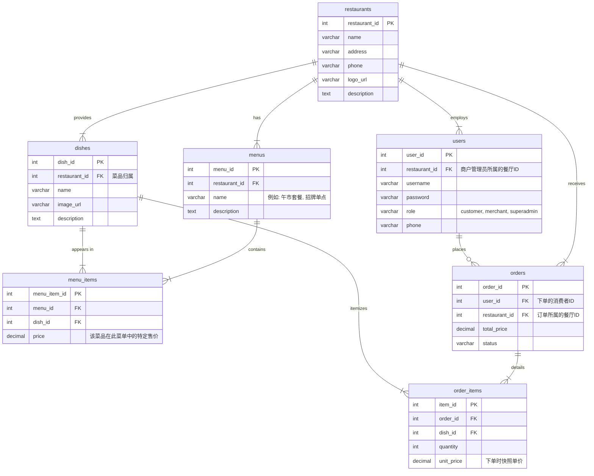

# **《网上订餐平台》项目开发文档 (V0.1)**

*   **项目名称:** 网上订餐平台 (Multi-Merchant Online Ordering Platform)
*   **课程:** 2025 秋季《Web应用系统开发技术与实践》
*   **团队成员:** A (组长), B, C, D, E
*   **文档版本:** V0.1 (初始规划文档)
*   **创建日期:** 2025年10月23日

---

## **第一阶段: 概念与构思 (Concept & Ideation)**

### 1. 产品愿景板 (Product Vision Board)

|                     |                                                              |
| :------------------ | :----------------------------------------------------------- |
| **愿景 (Vision)**   | 构建一个连接食客与周边餐厅的在线订餐平台，为入驻商户提供轻量级的数字化管理工具，为消费者提供丰富、便捷的订餐选择。 |
| **目标用户 (Target Group)** | - **消费者/食客 (Customers)**: 在校学生、教职工、周边居民。<br>- **商户管理员 (Merchants)**: 各大餐厅的店长或运营人员。<br>- **平台管理员 (Super Admin)**: 平台运营方，负责审核商户、管理平台规则。 |
| **核心需求 (Needs)**| - **消费者**: 发现并浏览不同餐厅、查看菜单并轻松下单、跟踪订单状态。<br>- **商户**: 独立管理自家餐厅信息、菜单、处理订单、查看营业数据。<br>- **平台**: 确保入驻商户的真实性、维护平台稳定运行。 |
| **核心产品 (Product)**| 一个支持多商户入驻的Web平台。包含三大端口：面向消费者的订餐前端、面向商户的独立管理后台、以及一个（在此项目中简化的）平台超级管理后台。 |
| **商业价值 (Value)**| 为传统餐饮商户提供低成本的线上流量入口和高效的订单管理方案。通过聚合众多餐厅，为消费者创造“一站式”的订餐便利，并通过平台效应实现盈利。 |

### 2. 用户画像 (User Personas)

#### Persona 1: 消费者 - 李雷 (学生)

*   **身份**: 大三学生，乐于尝试新鲜事物。
*   **目标与动机**:
    *   不想只吃食堂，希望能发现校园周边的各种美食。
    *   在一个App或网站上就能比较不同餐厅的菜品和价格。
    *   提前预定，避免等待。
*   **痛点**:
    *   不知道附近有哪些好吃的餐厅，信息零散。
    *   高峰期点餐、等餐时间长。

#### Persona 2: 商户管理员 - 王经理 (餐厅店主)

*   **身份**: “王记私房菜”餐厅店主。
*   **描述**: 50岁，传统餐饮人，希望拥抱互联网但缺乏技术能力，需要一个极其简单易用的后台。
*   **目标与动机**:
    *   让更多学生知道并光顾自己的餐厅。
    *   高效处理线上订单，避免手忙脚乱。
    *   **只能管理自己餐厅的菜单和订单**，不希望看到别家餐厅的数据。
    *   随时调整菜单，比如推出每日特价菜。
*   **痛点**:
    *   餐厅位置较偏，知名度不高。
    *   自建外卖网站成本高、维护难。
    *   依赖电话订餐，效率低且易出错。

---

### **附：核心用户流程图**

#### **消费者订餐流程**
```
用户进入平台 -> [首页]浏览餐厅列表/搜索餐厅 -> 选择进入某家餐厅的店铺页面 -> 浏览该餐厅的菜单 -> 添加菜品至购物车 -> 结算 -> 确认订单信息并提交 -> 查看订单状态 -> (线下取餐)
```

#### **商户管理流程**
```
商户管理员登录 -> 进入自家餐厅的管理仪表盘 -> [订单管理]查看并处理新订单 -> [菜单管理]添加/修改菜品分类 -> [菜单管理]上架/下架/编辑菜品信息 -> [店铺管理]更新餐厅基本信息 -> 查看营业统计
```
## **第二阶段: 初始与计划 (Inception & Planning)**

### 1. 高层技术架构设计 (High-Level Architecture)

*   **核心架构**: **多租户 (Multi-Tenancy)** 设计，确保商户间数据严格隔离。
*   **系统管理后台 (Merchant Backend)**: 采用**传统Java Web MVC模式**，使用 `Servlet` + `JSP` + `JSTL` 构建。所有业务逻辑都必须基于当前登录商户的`restaurant_id`进行数据过滤。
*   **客户端 (Client Frontend)**: 采用**前后端分离的单页应用 (SPA) 模式**，使用 `Vue.js` 框架构建。通过 `RESTful API` 与后端进行 `JSON` 数据交互。
*   **数据持久化**: 使用 `JDBC` 连接 `PostgreSQL` 数据库，通过DAO模式进行数据访问。
*   **数据隔离实现**: 在DAO层的每个SQL查询中，都将强制加入`WHERE restaurant_id = ?`条件，这是实现多商户安全的核心。

#### **高层技术架构示意图**
```mermaid
graph TD
    subgraph Browser
        A[消费者] --> B{客户端 Vue.js SPA};
        C[商户管理员] --> D[商户后台 JSP页面];
    end

    subgraph "Server (Tomcat)"
        B -- API请求(含restaurant_id) --> E[API Servlets];
        D -- HTTP请求 --> F[MVC Servlets];
        
        E -- "执行业务逻辑(带restaurant_id)" --> G[Service层];
        F -- "执行业务逻辑(从Session获取restaurant_id)" --> G;
        
        G -- "数据访问(带restaurant_id)" --> H[DAO层 (JDBC)];
    end

    subgraph "Database (PostgreSQL)"
        H -- "SELECT * FROM dishes WHERE restaurant_id = ?" --> I[(多租户数据表)];
    end

    E -- 返回JSON --> B;
    F -- 转发 (Forward) --> D;
```

### 2. 数据库设计 (Database Design)

数据库选用 `PostgreSQL`。主键统一使用 `SERIAL` 类型实现自增，日期时间使用 `TIMESTAMP` 类型。模型的核心是 `restaurants` 表，所有业务数据表都通过 `restaurant_id` 外键与之关联，形成数据归属。


ER图已完成设计，逻辑设计与表结构设计将在~/database/schema.sql中体现

### 3. 产品待办列表 (Product Backlog)
[产品待办列表](product-backlog.md)是一个动态列表，包含项目所有的期望实现的功能、需求和改进，将围绕一小点（US）进行拆解并分配任务。

### 4. 团队分工 (Division of Labor)

| 成员代号 | 角色                 | 主要职责                                                     |
| :------- | :------------------- | :----------------------------------------------------------- |
| **A**    | 组长 / 架构师        | 负责多租户架构设计，数据库建模，核心API的数据隔离逻辑，任务协调。 |
| **B**    | 后端开发 (Merchant)  | 负责**商户管理后台**所有功能的开发，确保所有数据库操作的租户隔离。 |
| **C**    | 后端开发 (Core/User) | 负责**多角色用户认证系统**（消费者、商户），商户注册流程，Filter开发。 |
| **D**    | 前端开发 (Client)    | 负责**消费者前端Vue.js应用**的开发，包括页面路由、组件化和API联调。 |
| **E**    | UI/UX & 文档工程师   | 负责使用Bootstrap进行所有页面的UI设计与美化，以及所有项目文档的撰写与维护。 |

### 5. 项目迭代计划 (Sprint Plan)

*   **项目周期**: 2025年10月23日 - 2025年11月16日
*   **总时长**: 25天 (约3.5周)

#### Sprint 1: 地基搭建 (10月27日 - 10月31日, 5天)
*   **目标**: 完成多商户数据库设计与构建，搭建项目骨架，实现商户和消费者的注册、登录功能。
*   **交付成果**: 用户可以注册为两种不同角色并登录。数据库支持多商户数据存储。

#### Sprint 2: 商户核心功能 (11月1日 - 11月6日, 6天)
*   **目标**: 实现商户后台的核心功能，包括店铺信息和菜单管理。
*   **交付成果**: 登录后的商户可以管理自己餐厅的分类和菜品（完整的CRUD）。

#### Sprint 3: 消费者核心流程 (11月7日 - 11月12日, 6天)
*   **目标**: 实现消费者的主要订餐流程。
*   **交付成果**: 消费者可以浏览餐厅列表，进入餐厅店铺，查看菜单，并成功下单。
 
##### 规划详解（API+前端+事务）
- 后端REST API（Servlet）：
  - `GET /api/restaurants`、`GET /api/restaurants/{id}`：餐厅列表与详情
  - `GET /api/restaurants/{id}/menus`、`GET /api/menus/{menuId}/items`：菜单与菜单项
  - `POST /api/orders`、`GET /api/orders/{orderId}`：下单与订单状态
  - 统一以`restaurant_id`过滤，所有写入在事务中完成
- 前端Vue（SPA）：
  - 路由：`/`、`/restaurants/:id`、`/checkout`、`/orders/:id`
  - 组件：`RestaurantList`、`RestaurantDetail`、`MenuItemCard`、`CartDrawer`、`CheckoutForm`、`OrderStatus`
  - 状态管理（Pinia/Vuex）：购物车以餐厅维度隔离，防止跨店混合
- JDBC事务与校验：
  - 创建`orders`后批量插入`order_items`；失败回滚；参数校验与跨租户拒绝
- 里程碑：
  - M1：只读API雏形
  - M2：前端路由与购物车打通（模拟下单）
  - M3：订单写入与状态查询
  - 验收：从首页到下单闭环，数据严格按`restaurant_id`隔离

#### Sprint 4: 订单闭环与整合 (11月13日 - 11月16日, 4天)
*   **目标**: 完成订单处理流程，进行端到端测试，录制Demo视频并完成所有交付文档。
*   **交付成果**: 商户可以在后台处理订单，消费者可以查看订单状态。项目完成并打包。

### 5. 迭代任务看板与工作量追踪

#### **Sprint 1 任务看板（已完成）**

**目标**: 完成多商户数据库设计与构建，搭建项目骨架，实现商户和消费者的注册、登录功能。

| 任务编号 | 关联用户故事 | 任务描述 | 负责人 | 状态 | 预估工作量评分 (1-3) | 完成日期 | 备注 |
| :--- | :--- | :--- | :--- | :--- | :--- | :--- | :--- |
| 1 | E01/US01 | 设计并编写数据库 schema.sql 脚本 (PostgreSQL) | A | 待办 | 3 | | 整个项目的数据基础 |
| 2 | E01/US01 | 创建项目总目录结构并配置 .gitignore | A | 待办 | 1 | | |
| 3 | E01/US04 | **搭建后端Maven项目骨架，并编写DBUtil工具类** | A | 待办 | 3 | | **后端地基** |
| 4 | E01/US07 | **编写并配置全站字符编码Filter和后台访问权限Filter** | A | 待办 | 2 | | **安全与通用逻辑** |
| 5 | E02/US08, US10 | **编写User.java实体类及UserDAO(接口+实现)，作为DAO层范例** | A | 待办 | 3 | | **后端开发模式范例** |
| 6 | E01/US03, US02 | **创建后台通用布局(header/footer.jsp)，并整合Bootstrap** | A | 待办 | 2 | | **前端地基** |
| 7 | E02/US09 | 编写Restaurant.java实体类 | B | 待办 | 1 | | |
| 8 | E02/US09 | **遵循A的模式**，编写RestaurantDAO(接口+实现) | B | 待办 | 2 | | 依赖任务5完成 |
| 9 | E02/US08, US09 | 编写RegistrationServlet，处理两种注册请求 | B | 待办 | 3 | | 依赖任务5和8 |
| 10 | E02/US10, US11 | 编写LoginServlet，处理登录请求并管理Session | C | 待办 | 3 | | 依赖任务5 |
| 11 | E02/US08 | **使用A的布局**，编写消费者注册页面 register-customer.jsp | D | 待办 | 2 | | 依赖任务6 |
| 12 | E02/US09 | **使用A的布局**，编写商户注册页面 register-merchant.jsp | D | 待办 | 2 | | 依赖任务6 |
| 13 | E02/US10 | **使用A的布局**，编写统一登录页面 login.jsp | E | 待办 | 1 | | 依赖任务6 |
| 14 | E02/US11 | **使用A的布局**，创建商户后台仪表盘占位页面 dashboard.jsp | E | 待办 | 1 | | 登录后跳转目标页 |

#### **团队协作看板用法与说明**

这个表格是我们团队在本次项目中进行**任务分配、进度跟踪和工作量评估**的工具。为了确保我们高效地进行线上协作，请每位成员仔细阅读并遵循以下说明。

##### **一、 各列含义详解**

*   **任务编号**: 一个独一无二的数字ID，方便我们在讨论时快速定位到某个具体任务（例如，“关于任务5，我有个问题…”）。
*   **关联用户故事**: 告诉我们“**为什么要做这个任务**”。它将我们的技术工作与一个具体的产品功能（用户故事）联系起来，帮助我们理解工作的价值。
*   **任务描述**: 告诉我们“**具体要做什么**”。这是对任务最直接的描述，应该是清晰、可执行的。
*   **负责人**: 告诉我们“**由谁来做**”。这明确了每个任务的责任人。
*   **状态**: 告诉我们“**任务进展如何**”。这是我们跟踪项目进度的核心。它有三个值：
    *   `待办`: 任务已分配，但还未开始。
    *   `进行中`: 负责人已经开始着手处理这个任务。
    *   `已完成`: 任务的所有工作已经结束。
    *   *(建议: 如果你们使用的在线表格支持，可以为这三个状态设置不同的背景色，如灰色、蓝色、绿色，让进度一目了然。)*
*   **预估工作量评分 (1-3)**: 评估“**这个任务有多复杂**”。这不是一个精确的时间单位，而是一个相对的评估：
    *   **1 (低)**: 简单、直接的任务，通常半天内可以完成。
    *   **2 (中)**: 标准复杂度的任务，可能需要一整天的时间。
    *   **3 (高)**: 比较复杂的核心任务，可能需要超过一天的时间来设计和开发。
    *   这个评分帮助组长平衡每个人的工作负载，也是我们期末计算贡献度的重要参考。
*   **完成日期**: 记录“**任务是何时完成的**”。这是一个简单的历史记录，方便我们回顾进度。
*   **备注**: 一个**异步沟通渠道**。如果你在任务中遇到了问题（比如需要等别人的工作、有技术疑问），请在这里注明，并及时在群里通知相关人员。

##### **二、 我们的工作流程**

**阶段一：Sprint规划 (每周开始时)**

1.  组长A会根据我们的“产品待办列表”，将本周需要完成的用户故事分解成具体的、可执行的任务，并填入此表格。
2.  团队成员一起快速过一遍任务列表，确认任务描述清晰，并分配好每个任务的`负责人`和`预估工作量评分`。
3.  此时，所有新任务的`状态`都应为`待办`。

**阶段二：每日工作 (这是每个成员都需要遵守的)**

1.  **开始一天的工作**: 打开这个表格，查看分配给你的、状态为`待办`的任务。
2.  **领取一个任务**: 决定好今天要做哪个任务后，**第一件事**就是找到对应的行，将`状态`从`待办`**更新为**`进行中`。
    *   **这非常重要！** 它告诉所有人“我正在做这件事”，避免了信息不同步和重复劳动。
3.  **完成一个任务**: 当你完成了这个任务的所有工作后，你需要做 **2** 件事：
    *   将`状态`**更新为**`已完成`。
    *   在`完成日期`列填上今天的日期。

**阶段三：沟通与同步 (每天)**

*   **遇到困难**: 如果一个`进行中`的任务让你卡住了，请立即在`备注`列写下问题，并在团队沟通群里 **@** 相关的同学或组长。**不要独自卡住超过半小时**。
*   **每日简报**: 每天下线前，建议大家在群里发一个简短的状态更新，例如：“今天我完成了任务7和8，明天计划开始任务11”。这有助于保持团队的节奏感。

遵循这个简单的流程，我们就能确保即使完全线上沟通，也能像一个紧密的团队一样高效工作。加油！
#### **Sprint 2 任务看板（待办）**

**目标**: 实现商户后台核心功能，包括店铺信息和菜单管理（完整 CRUD），严格遵循多租户数据隔离。

| 任务编号 | 关联用户故事 | 任务描述 | 负责人 | 状态 | 预估工作量评分 (1-3) | 完成日期 | 备注 |
| :--- | :--- | :--- | :--- | :--- | :--- | :--- | :--- |
| 201 | US-14 | 搭建商户仪表盘骨架（统计占位 + 菜单/订单入口） | E | 待办 | 1 | | 骨架优先，不阻塞 CRUD |
| 202 | US-15 | 餐厅信息管理 DAO 接口与实现（`sql_*` 命名 + `restaurant_id` 过滤） | B | 待办 | 2 | | DAO 规范与隔离 |
| 203 | US-15 | RestaurantServlet 与表单校验（创建/编辑/查看） | B | 待办 | 2 | | 依赖 202 |
| 204 | US-16 | 菜单分类管理 DAO 接口与实现（`menus`） | B | 待办 | 2 | | 依赖 211 规范 |
| 205 | US-16 | MenuServlet 与列表/创建/编辑/删除 JSP 页 | B/E | 待办 | 3 | | B 主程，E 提供样式 |
| 206 | US-17 | 菜品管理 DAO 接口与实现（`dishes`，含 `image_url`） | B | 待办 | 2 | | 依赖 211 规范 |
| 207 | US-17 | DishServlet 与列表/创建/编辑/删除 JSP 页 | B/E | 待办 | 3 | | 图片上传交互协作 |
| 208 | US-16/17 | `menu_items` 绑定逻辑与重复绑定提示（软校验，可选） | B | 待办 | 2 | | 用户体验与提示 |
| 209 | US-07/US-13 | 加强 AuthFilter 与会话上下文：在 `/admin/*` 下统一从 Session 传递 `restaurant_id` | C | 待办 | 2 | | 统一租户上下文 |
| 210 | NFR/US-04/US-05 | 统一 JSP 布局与 Bootstrap 风格（`header.jsp`/`footer.jsp`/管理端导航） | E | 待办 | 2 | | 视图统一与复用 |
| 211 | NFR | DAO 层基线与模板：DBUtil 用法、PreparedStatement 规范、异常处理与中文注释模板 | A | 待办 | 2 | | 后端地基与示例 |
| 212 | NFR | 多租户隔离审计：检查所有 CRUD 方法带 `restaurant_id` 条件 | A | 待办 | 2 | | 安全与一致性 |
| 213 | 数据 | 扩充初始数据：至少两家餐厅分类与菜品演示数据 | A | 待办 | 1 | | 覆盖隔离场景 |
| 214 | 测试 | `webapp/test/` 添加租户隔离验证页（仅显示本人餐厅数据） | C/A | 待办 | 1 | | 演示与自测 |

##### **开发顺序与协同约定（Sprint 2）**

- 先行任务：209（会话/过滤器）与 211（DAO 模板），A 并行执行 212 审计。
- 主线 CRUD：B 并行推进 202–208（餐厅→菜单→菜品→菜单项绑定），E 提供统一样式与布局组件。
- 验证与演示：完成后执行 213（数据扩充）与 214（测试页），验证隔离与功能演示。
- 仪表盘：201 由 E 搭骨架，后续由 B 挂接真实数据。
